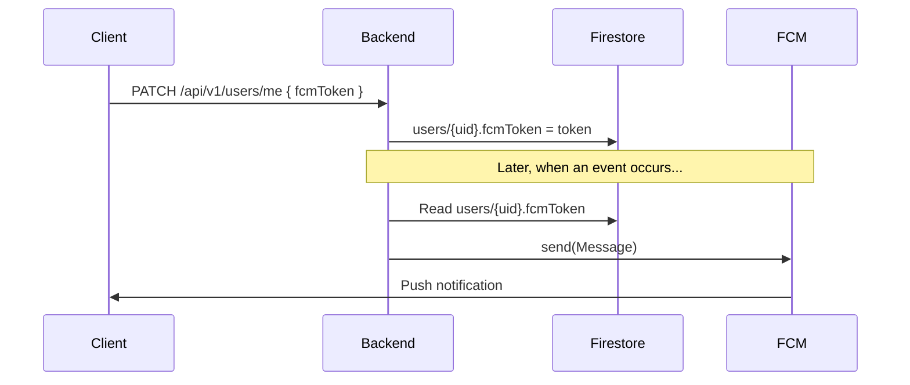
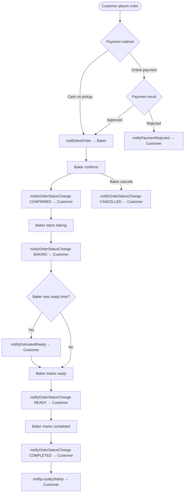

The Panahashi backend sends push notifications through Firebase Cloud Messaging (FCM) to keep bakers and customers informed as orders move through the system. All notifications are sent server-side using the Firebase Admin SDK — the client only needs to register a valid FCM token.

## How notifications work

When a significant event occurs (a new order, a status change, a loyalty stamp, etc.), the backend fetches the target user's FCM token from their Firestore document at `users/{uid}.fcmToken`, constructs a message, and calls `FirebaseMessaging.getInstance().send(message)`. If the user does not have a token stored, no notification is sent.



## Registering a device token

When the app launches (or when the FCM token refreshes), the client must send the new token to the backend so the server always has a valid address to deliver notifications to.

Send a `PATCH` request to `/api/v1/users/me` with the `fcmToken` field in the request body:

<CodeGroup>

```bash cURL
curl -X PATCH https://your-api-host/api/v1/users/me \
  -H "Authorization: Bearer <firebase-id-token>" \
  -H "Content-Type: application/json" \
  -d '{"fcmToken": "your-fcm-device-token"}'
```

```javascript React Native
import messaging from '@react-native-firebase/messaging';

async function registerFcmToken(authToken: string) {
  const fcmToken = await messaging().getToken();

  await fetch('https://your-api-host/api/v1/users/me', {
    method: 'PATCH',
    headers: {
      Authorization: `Bearer ${authToken}`,
      'Content-Type': 'application/json',
    },
    body: JSON.stringify({ fcmToken }),
  });
}
```

</CodeGroup>

<Note>
  Call this function on every app launch, not just on the first install. FCM tokens can be refreshed by the device at any time. Use `messaging().onTokenRefresh(token => registerFcmToken(authToken))` to handle mid-session refreshes.
</Note>

## Notification events

The table below lists every notification the backend can send, including the Spanish-language strings used in the app (Panahashi serves the Colombian market).

| Event | Trigger | Recipient | Title | Body |
|-------|---------|-----------|-------|------|
| New order (cash) | Customer places a cash-on-pickup order | Baker | `¡Nuevo Pedido!` | `Tienes un nuevo pedido de {customerName}` |
| New order (payment approved) | Payment gateway approves payment | Baker | `¡Nuevo Pedido!` | `Tienes un nuevo pedido de {customerName}` |
| Order confirmed | Baker confirms the order | Customer | `Pedido Confirmado` | `Tu pedido ha sido confirmado y está siendo preparado` |
| Order baking | Baker marks order as in progress | Customer | `Pedido en Preparación` | `Tu pedido está siendo preparado` |
| Order ready | Baker marks order as ready for pickup | Customer | `¡Pedido Listo!` | `Tu pedido está listo para recoger` |
| Order completed | Baker marks order as completed | Customer | `Pedido Completado` | `Tu pedido ha sido completado. ¡Gracias por tu compra!` |
| Order cancelled | Baker or system cancels the order | Customer | `Pedido Cancelado` | `Tu pedido ha sido cancelado` |
| Bakery activated | Admin activates a baker's bakery | Baker | `¡Panadería Activada!` | `Tu panadería {bakeryName} ha sido activada` |
| Estimated ready time | Baker sets an estimated ready time | Customer | `Tiempo Estimado Actualizado` | `Tu pedido estará listo aproximadamente a las {estimatedReadyAt}` |
| Loyalty stamp awarded | Order completed; stamp recorded | Customer | `¡Sello de Fidelidad!` | `Has ganado un sello en {bakeryName}. Tienes {stamps}/{stampsForReward} sellos` |
| Payment rejected | Payment gateway rejects payment | Customer | `Pago Rechazado` | `El pago de tu pedido {orderId} fue rechazado` |

## Order status notification flow

As an order moves through its lifecycle, specific notifications fire at each transition. The diagram below shows the full flow from order placement to completion or cancellation.



## Client implementation (React Native)

The following example shows how to set up FCM in a React Native app, request permissions, register the token, and handle incoming notifications.

```javascript
import messaging from '@react-native-firebase/messaging';
import { useEffect } from 'react';

export function usePushNotifications(authToken: string | null) {
  useEffect(() => {
    if (!authToken) return;

    // Request permission (iOS requires explicit request)
    messaging()
      .requestPermission()
      .then(async (status) => {
        if (
          status === messaging.AuthorizationStatus.AUTHORIZED ||
          status === messaging.AuthorizationStatus.PROVISIONAL
        ) {
          const token = await messaging().getToken();
          await registerFcmToken(authToken, token);
        }
      });

    // Handle token refresh
    const unsubscribeRefresh = messaging().onTokenRefresh((token) => {
      registerFcmToken(authToken, token);
    });

    // Handle notifications received while the app is in the foreground
    const unsubscribeForeground = messaging().onMessage(async (remoteMessage) => {
      console.log('Foreground notification:', remoteMessage.notification);
      // Show an in-app alert or update your UI here
    });

    return () => {
      unsubscribeRefresh();
      unsubscribeForeground();
    };
  }, [authToken]);
}

async function registerFcmToken(authToken: string, fcmToken: string) {
  await fetch('https://your-api-host/api/v1/users/me', {
    method: 'PATCH',
    headers: {
      Authorization: `Bearer ${authToken}`,
      'Content-Type': 'application/json',
    },
    body: JSON.stringify({ fcmToken }),
  });
}
```

## Foreground and background handling

<Tabs>
  <Tab title="Background / quit state">
    When the app is in the background or closed, FCM delivers the notification to the device's notification tray. Tapping the notification launches the app. Use `messaging().getInitialNotification()` in your root component to read the notification that opened the app and navigate accordingly.

    ```javascript
    const remoteMessage = await messaging().getInitialNotification();
    if (remoteMessage) {
      // Navigate to the relevant order or screen
    }
    ```
  </Tab>
  <Tab title="Foreground">
    When the app is open, FCM does not display a system notification automatically. Use the `onMessage` listener (shown in the example above) to present an in-app banner or update the relevant screen in real time.
  </Tab>
</Tabs>

<Warning>
  Notifications are only delivered if the target user has a valid `fcmToken` stored in their Firestore profile. If a user never calls `PATCH /api/v1/users/me` with their token — or if the token is stale — the notification is silently dropped. Always register the token on login and refresh it when FCM reports a new one.
</Warning>
